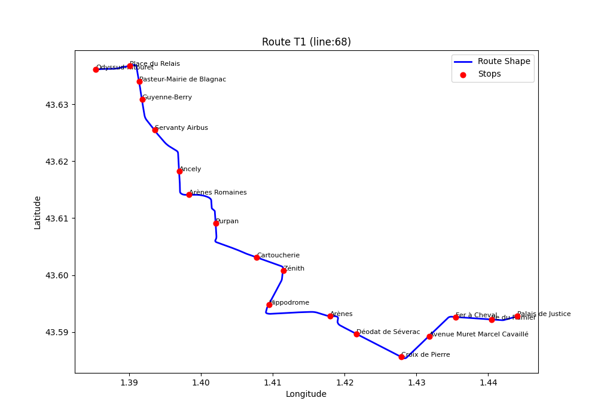
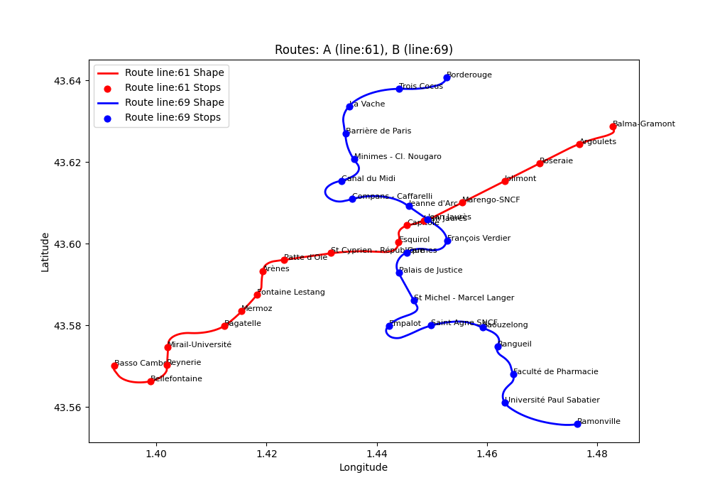

# MetRose

## Carte des lignes



## Install
### Ubuntu
```bash
git clone https://github.com/ritonun/MetRose.git
cd metrose
python3 -m venv .venv
source .venv/bin/activate
pip install -r requirements.txt
```

### Windows
```bash
git clone https://github.com/ritonun/MetRose.git
cd metrose
python -m venv .venv
.venv\Scripts\Activate
pip install -r requirements.txt
```

## Run the programm
Pour windows, remplace `python3` par `python`
### Download le dataset
Download le dataset (necessaire de lancer la commande au mois une fois)
```bash
python3 src/api.py
```

### Lancer la visualisation en ligne
Lancer le programme python dans le terminal
```bash
python3 src/web.py
```
Puis aller dans l'url:
[http://127.0.0.1:5000/](http://127.0.0.1:5000/)
